# BÁO CÁO ĐỒ ÁN
# HỆ THỐNG THUYẾT MINH ẨM THỰC — FOODMAP
## Phố Ẩm Thực Vĩnh Khánh

---

## MỤC LỤC

1. [Giới thiệu đề tài](#1-giới-thiệu-đề-tài)
2. [Kiến trúc hệ thống](#2-kiến-trúc-hệ-thống)
3. [Sơ đồ Use Case](#3-sơ-đồ-use-case)
4. [Sơ đồ cơ sở dữ liệu (ERD)](#4-sơ-đồ-cơ-sở-dữ-liệu-erd)
5. [Sơ đồ hoạt động (Activity Diagram)](#5-sơ-đồ-hoạt-động)
6. [Sơ đồ tuần tự (Sequence Diagram)](#6-sơ-đồ-tuần-tự-chi-tiết)
7. [Sơ đồ triển khai (Deployment Diagram)](#7-sơ-đồ-triển-khai)
8. [Sơ đồ thành phần (Component Diagram)](#8-sơ-đồ-thành-phần)
9. [Công nghệ sử dụng](#9-công-nghệ-sử-dụng)
10. [Chi tiết các module](#10-chi-tiết-các-module)
11. [Kết luận](#11-kết-luận)

---

## 1. Giới thiệu đề tài

### 1.1 Tên đề tài
**Hệ thống thuyết minh ẩm thực — FoodMap** (Phố Ẩm Thực Vĩnh Khánh)

### 1.2 Mô tả
FoodMap là hệ thống thuyết minh tự động cho các điểm ẩm thực tại Phố Ẩm Thực Vĩnh Khánh (Quận 4, TP.HCM). Hệ thống bao gồm:

- **Ứng dụng Android** cho du khách: Hiển thị bản đồ, thuyết minh bằng giọng nói (Text-to-Speech) đa ngôn ngữ (Tiếng Việt, English, 日本語, 中文), hoạt động offline.
- **Trang quản trị Web** cho Admin và Seller: Quản lý điểm thuyết minh (POI), tour, audio, bản dịch, quầy hàng, người dùng.

### 1.3 Mục tiêu
- Cung cấp thông tin ẩm thực cho du khách qua thuyết minh tự động
- Hỗ trợ đa ngôn ngữ (Việt, Anh, Nhật, Trung)
- Hoạt động offline trên thiết bị di động
- Quản trị nội dung dễ dàng qua giao diện web

### 1.4 Phạm vi
- **Người dùng**: Du khách (Mobile App), Admin (Web), Seller/Người bán (Web)
- **Khu vực**: Phố Ẩm Thực Vĩnh Khánh, Quận 4, TP.HCM

---

## 2. Kiến trúc hệ thống

### 2.1 Sơ đồ kiến trúc tổng quan

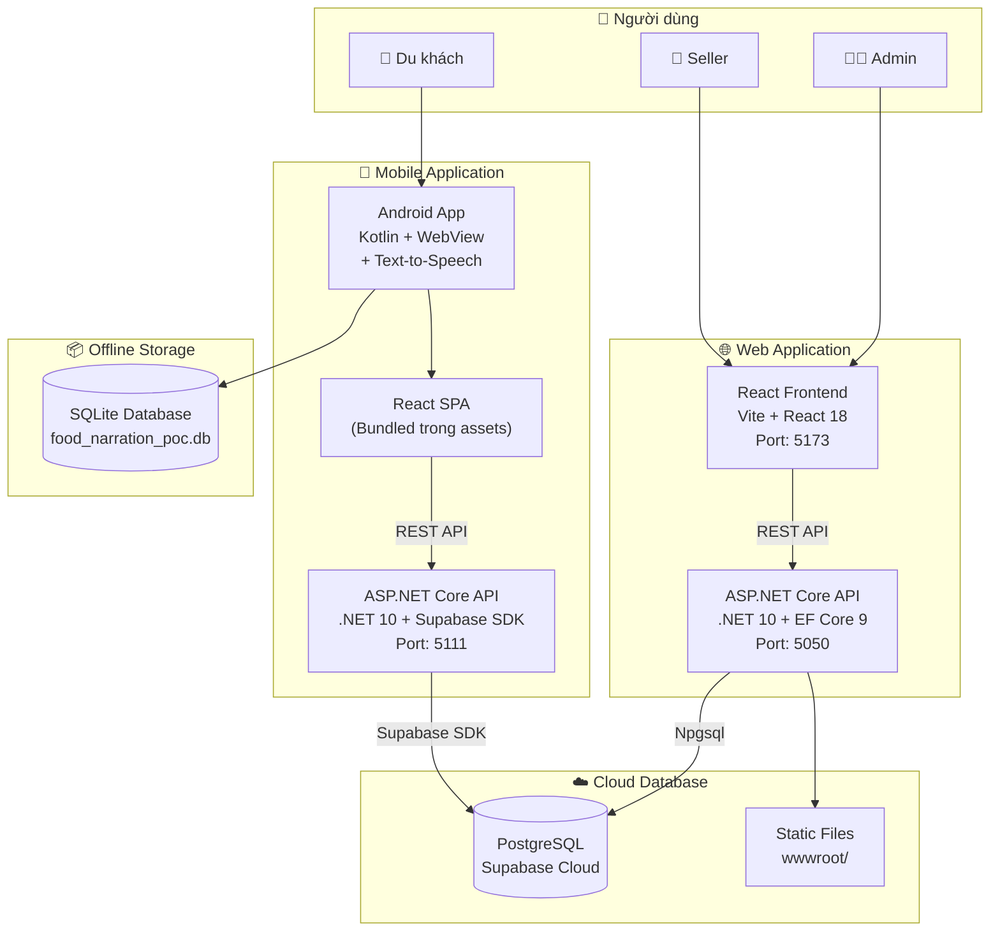
```mermaid
graph TB
    subgraph "👤 Người dùng"
        U1["🧑‍💼 Admin"]
        U2["🏪 Seller"]
        U3["📱 Du khách"]
    end

    subgraph "🌐 Web Application"
        WF["React Frontend<br/>Vite + React 18<br/>Port: 5173"]
        WB["ASP.NET Core API<br/>.NET 10 + EF Core 9<br/>Port: 5050"]
    end

    subgraph "📱 Mobile Application"
        MA["Android App<br/>Kotlin + WebView<br/>+ Text-to-Speech"]
        MF["React SPA<br/>(Bundled trong assets)"]
        MB["ASP.NET Core API<br/>.NET 10 + Supabase SDK<br/>Port: 5111"]
    end

    subgraph "☁️ Cloud Database"
        DB[(PostgreSQL<br/>Supabase Cloud)]
        ST["Static Files<br/>wwwroot/"]
    end

    subgraph "📦 Offline Storage"
        SQ[(SQLite Database<br/>food_narration_poc.db)]
    end

    U1 --> WF
    U2 --> WF
    WF -->|REST API| WB
    WB -->|Npgsql| DB
    WB --> ST

    U3 --> MA
    MA --> MF
    MF -->|REST API| MB
    MB -->|Supabase SDK| DB
    MA --> SQ
```

### 2.2 Cấu trúc thư mục

```
c:\doan\
├── app\app\                              # 📱 Phần Mobile
│   ├── AndroidStudioProjects\FoodMapApp\ # Android App (Kotlin + WebView)
│   │   └── app\src\main\
│   │       ├── java\..\MainActivity.kt   # Activity chính chứa WebView + TTS
│   │       ├── assets\                   # React build + SQLite DB + audio
│   │       └── AndroidManifest.xml       # Permissions: INTERNET, GPS
│   ├── FoodMapAPI\                       # Backend API cho Mobile (.NET 10)
│   │   ├── Controllers\                  # PlacesController, ToursController,
│   │   │                                 # UsersController, FavoriteController
│   │   ├── Models\                       # 9 Models
│   │   ├── wwwroot\                      # Static files (ảnh, audio)
│   │   └── Program.cs                    # Supabase Client SDK, port 5111
│   └── foodmap-fe\                       # React Frontend cho mobile (CRA)
│       └── src\App.js                    # App chính + offlineDB.js
│
├── web\web\                              # 🌐 Phần Web Admin
│   ├── backend\                          # Backend API cho Web (.NET 10)
│   │   ├── Controllers\                  # 15 Controllers (Auth, POI, Tour,
│   │   │                                 # Stall, Audio, Translation, ...)
│   │   ├── Models\                       # 15 Models
│   │   ├── AppDbContext.cs               # EF Core DbContext (13 DbSet)
│   │   └── Program.cs                    # Npgsql + JWT + CORS, port 5050
│   └── frontend\                         # React Frontend (Vite + React 18)
│       └── src\
│           ├── admin\                    # 8 trang: Dashboard, POI, Tour,
│           │                             # Audio, Translation, User, History, Pending
│           ├── seller\                   # 3 trang: Dashboard, Audio, Translation
│           ├── App.jsx                   # Router (ProtectedRoute by role)
│           ├── Login.jsx                 # Đăng nhập (JWT)
│           └── Register.jsx              # Đăng ký (Seller)
│
├── BAO_CAO_DU_AN.md                      # 📄 File này
└── HUONG_DAN_CHAY.md                     # 📄 Hướng dẫn chạy chi tiết
```

---

## 3. Sơ đồ Use Case

### 3.1 Use Case Diagram

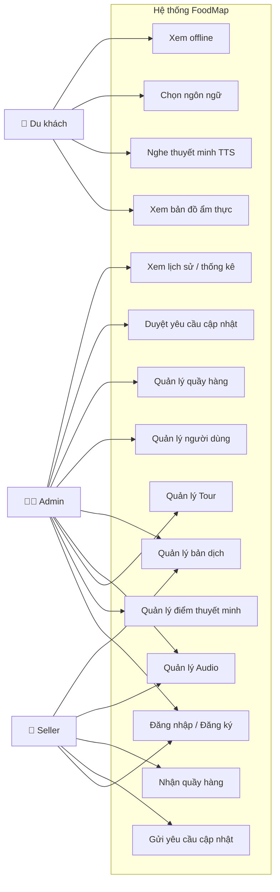
```mermaid
graph LR
    subgraph "Hệ thống FoodMap"
        UC1["Xem bản đồ ẩm thực"]
        UC2["Nghe thuyết minh TTS"]
        UC3["Chọn ngôn ngữ"]
        UC4["Xem offline"]
        UC5["Đăng nhập / Đăng ký"]
        UC6["Quản lý điểm thuyết minh"]
        UC7["Quản lý Tour"]
        UC8["Quản lý Audio"]
        UC9["Quản lý bản dịch"]
        UC10["Quản lý người dùng"]
        UC11["Quản lý quầy hàng"]
        UC12["Duyệt yêu cầu cập nhật"]
        UC13["Xem lịch sử / thống kê"]
        UC14["Gửi yêu cầu cập nhật"]
        UC15["Nhận quầy hàng"]
    end

    DK["👤 Du khách"] --> UC1
    DK --> UC2
    DK --> UC3
    DK --> UC4

    AD["🧑‍💼 Admin"] --> UC5
    AD --> UC6
    AD --> UC7
    AD --> UC8
    AD --> UC9
    AD --> UC10
    AD --> UC11
    AD --> UC12
    AD --> UC13

    SL["🏪 Seller"] --> UC5
    SL --> UC14
    SL --> UC15
    SL --> UC8
    SL --> UC9
```

### 3.2 Mô tả Use Case chi tiết

| STT | Use Case | Actor | Mô tả |
|---|---|---|---|
| UC1 | Xem bản đồ | Du khách | Hiển thị bản đồ Leaflet với các điểm POI |
| UC2 | Nghe thuyết minh | Du khách | Phát giọng đọc TTS native Android (AndroidBridge.speak) |
| UC3 | Chọn ngôn ngữ | Du khách | Đổi ngôn ngữ: vi, en, ja, zh |
| UC4 | Xem offline | Du khách | Dùng SQLite local (sql.js WebAssembly) |
| UC5 | Đăng nhập/Đăng ký | Admin, Seller | JWT Bearer Token (BCrypt hash, 2h expiry) |
| UC6 | Quản lý POI | Admin | CRUD narration_points + stalls + food_places + images |
| UC7 | Quản lý Tour | Admin | CRUD tours + tour_pois (raw NpgsqlConnection) |
| UC8 | Quản lý Audio | Admin, Seller | Upload/sửa/xóa audio thuyết minh |
| UC9 | Quản lý bản dịch | Admin, Seller | CRUD narration_translations (4 ngôn ngữ) |
| UC10 | Quản lý user | Admin | Xem, khóa/mở khóa tài khoản (status: Active/Locked) |
| UC11 | Quản lý stall | Admin | CRUD stalls, gắn vào POI, đổi status |
| UC12 | Duyệt yêu cầu | Admin | Approve/Reject (Transaction + 3 Case: Claim/Create/Update) |
| UC13 | Xem thống kê | Admin | Dashboard overview, history heatmap |
| UC14 | Gửi yêu cầu | Seller | Đề xuất sửa audio/stall/translation → Pending |
| UC15 | Nhận quầy | Seller | Claim Unclaimed stall → PendingClaim → Admin duyệt |

---

## 4. Sơ đồ cơ sở dữ liệu (ERD)

### 4.1 Entity Relationship Diagram

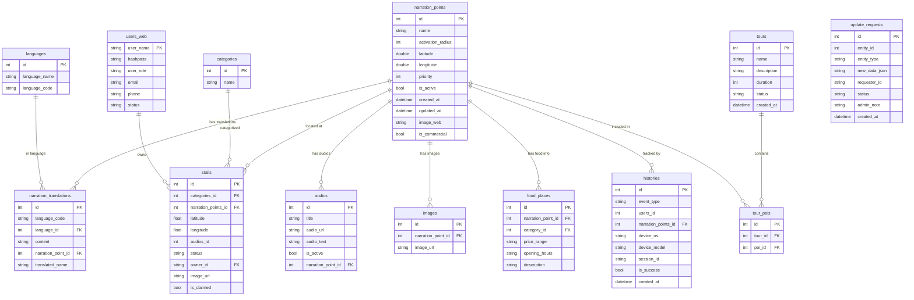
```mermaid
erDiagram
    users_web {
        string user_name PK
        string hashpass
        string user_role
        string email
        string phone
        string status
    }

    narration_points {
        int id PK
        string name
        int activation_radius
        double latitude
        double longitude
        int priority
        bool is_active
        datetime created_at
        datetime updated_at
        string image_web
        bool is_commercial
    }

    narration_translations {
        int id PK
        string language_code
        int language_id FK
        string content
        int narration_point_id FK
        string translated_name
    }

    languages {
        int id PK
        string language_name
        string language_code
    }

    categories {
        int id PK
        string name
    }

    tours {
        int id PK
        string name
        string description
        int duration
        string status
        datetime created_at
    }

    tour_pois {
        int id PK
        int tour_id FK
        int poi_id FK
    }

    food_places {
        int id PK
        int narration_point_id FK
        int category_id FK
        string price_range
        string opening_hours
        string description
    }

    stalls {
        int id PK
        int categories_id FK
        int narration_points_id FK
        float latitude
        float longitude
        int audios_id
        string status
        string owner_id FK
        string image_url
        bool is_claimed
    }

    audios {
        int id PK
        string title
        string audio_url
        string audio_text
        bool is_active
        int narration_point_id FK
    }

    images {
        int id PK
        int narration_point_id FK
        string image_url
    }

    histories {
        int id PK
        string event_type
        int users_id
        int narration_points_id FK
        string device_os
        string device_model
        string session_id
        bool is_success
        datetime created_at
    }

    update_requests {
        int id PK
        int entity_id
        string entity_type
        string new_data_json
        string requester_id
        string status
        string admin_note
        datetime created_at
    }

    narration_points ||--o{ narration_translations : "has translations"
    narration_points ||--o{ audios : "has audios"
    narration_points ||--o{ images : "has images"
    narration_points ||--o{ food_places : "has food info"
    narration_points ||--o{ stalls : "located at"
    narration_points ||--o{ histories : "tracked by"
    languages ||--o{ narration_translations : "in language"
    categories ||--o{ stalls : "categorized"
    tours ||--o{ tour_pois : "contains"
    narration_points ||--o{ tour_pois : "included in"
    users_web ||--o{ stalls : "owns"
```

### 4.2 Mô tả các bảng (13 bảng)

| STT | Tên bảng | Mô tả | PK |
|---|---|---|---|
| 1 | `users_web` | Người dùng (Admin/Seller) | user_name |
| 2 | `narration_points` | Điểm thuyết minh (POI) | id (auto) |
| 3 | `narration_translations` | Bản dịch đa ngôn ngữ | id (auto) |
| 4 | `languages` | Ngôn ngữ hỗ trợ (vi, en, ja, zh) | id (auto) |
| 5 | `categories` | Danh mục phân loại | id (auto) |
| 6 | `tours` | Tour ẩm thực | id (auto) |
| 7 | `tour_pois` | Liên kết Tour ↔ POI (N:N) | id (auto) |
| 8 | `food_places` | Thông tin ăn uống | id (auto) |
| 9 | `stalls` | Quầy hàng (Seller) | id (auto) |
| 10 | `audios` | File audio thuyết minh | id (auto) |
| 11 | `images` | Hình ảnh POI | id (auto) |
| 12 | `histories` | Lịch sử hoạt động | id (auto) |
| 13 | `update_requests` | Yêu cầu cập nhật (Pending → Approved/Rejected) | id (auto) |

---

## 5. Sơ đồ hoạt động

### 5.1 Luồng đăng nhập (AuthController.Login)

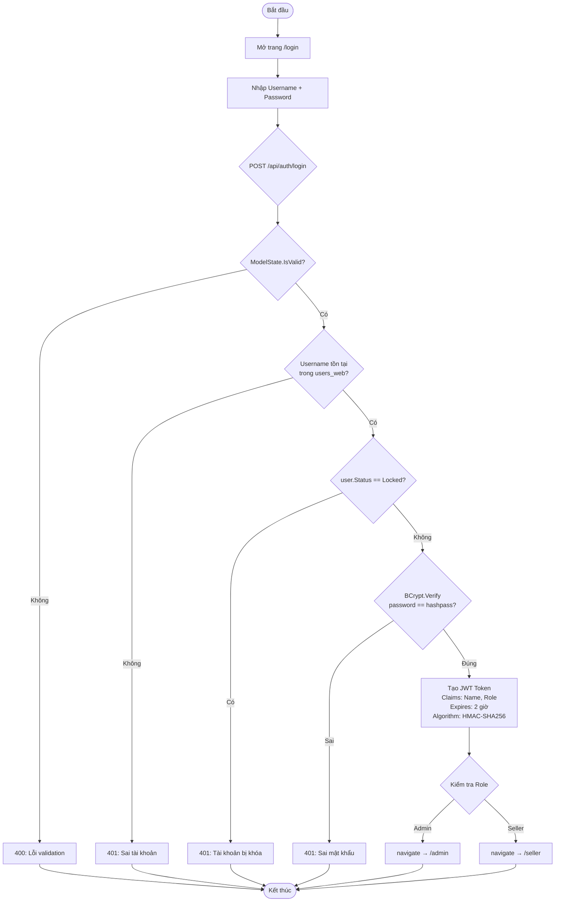
```mermaid
flowchart TD
    A([Bắt đầu]) --> B[Mở trang /login]
    B --> C[Nhập Username + Password]
    C --> D{POST /api/auth/login}
    D --> E{ModelState.IsValid?}
    E -->|Không| F[400: Lỗi validation]
    E -->|Có| G{Username tồn tại<br/>trong users_web?}
    G -->|Không| H[401: Sai tài khoản]
    G -->|Có| I{user.Status == Locked?}
    I -->|Có| J[401: Tài khoản bị khóa]
    I -->|Không| K{BCrypt.Verify<br/>password == hashpass?}
    K -->|Sai| L[401: Sai mật khẩu]
    K -->|Đúng| M[Tạo JWT Token<br/>Claims: Name, Role<br/>Expires: 2 giờ<br/>Algorithm: HMAC-SHA256]
    M --> N{Kiểm tra Role}
    N -->|Admin| O[navigate → /admin]
    N -->|Seller| P[navigate → /seller]
    F --> Q([Kết thúc])
    H --> Q
    J --> Q
    L --> Q
    O --> Q
    P --> Q
```

### 5.2 Luồng tạo POI (NarrationPointController.Create)

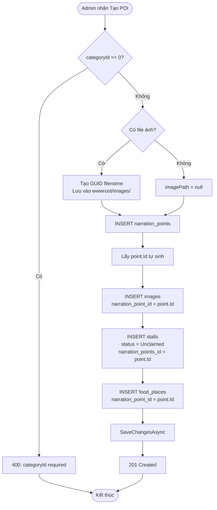
```mermaid
flowchart TD
    A([Admin nhấn Tạo POI]) --> B{categoryId == 0?}
    B -->|Có| C[400: categoryId required]
    B -->|Không| D{Có file ảnh?}
    D -->|Có| E[Tạo GUID filename<br/>Lưu vào wwwroot/images/]
    D -->|Không| F[imagePath = null]
    E --> G[INSERT narration_points]
    F --> G
    G --> H[Lấy point.Id tự sinh]
    H --> I[INSERT images<br/>narration_point_id = point.Id]
    I --> J[INSERT stalls<br/>status = Unclaimed<br/>narration_points_id = point.Id]
    J --> K[INSERT food_places<br/>narration_point_id = point.Id]
    K --> L[SaveChangesAsync]
    L --> M[201 Created]
    C --> N([Kết thúc])
    M --> N
```

### 5.3 Luồng Seller nhận quầy → Admin duyệt

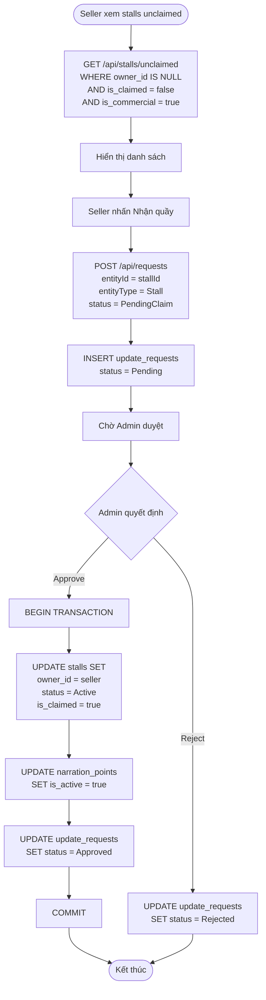
```mermaid
flowchart TD
    A([Seller xem stalls unclaimed]) --> B[GET /api/stalls/unclaimed<br/>WHERE owner_id IS NULL<br/>AND is_claimed = false<br/>AND is_commercial = true]
    B --> C[Hiển thị danh sách]
    C --> D[Seller nhấn Nhận quầy]
    D --> E[POST /api/requests<br/>entityId = stallId<br/>entityType = Stall<br/>status = PendingClaim]
    E --> F[INSERT update_requests<br/>status = Pending]
    F --> G[Chờ Admin duyệt]
    G --> H{Admin quyết định}
    H -->|Approve| I[BEGIN TRANSACTION]
    I --> J[UPDATE stalls SET<br/>owner_id = seller<br/>status = Active<br/>is_claimed = true]
    J --> K[UPDATE narration_points<br/>SET is_active = true]
    K --> L[UPDATE update_requests<br/>SET status = Approved]
    L --> M[COMMIT]
    H -->|Reject| N[UPDATE update_requests<br/>SET status = Rejected]
    M --> O([Kết thúc])
    N --> O
```

---

## 6. Sơ đồ tuần tự chi tiết

> Tất cả sơ đồ dưới đây được xây dựng từ source code thực tế trong các Controller.

### 6.1 Đăng ký tài khoản Seller (AuthController.Register)

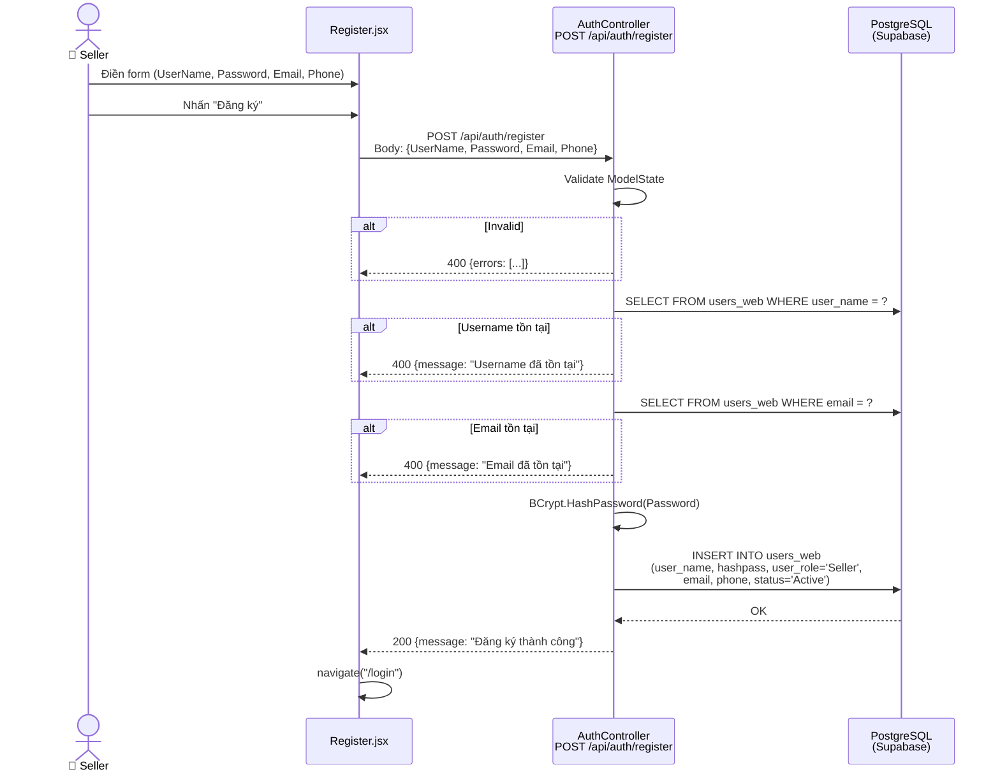
```mermaid
sequenceDiagram
    actor Seller as 🏪 Seller
    participant FE as Register.jsx
    participant API as AuthController<br/>POST /api/auth/register
    participant DB as PostgreSQL<br/>(Supabase)

    Seller->>FE: Điền form (UserName, Password, Email, Phone)
    Seller->>FE: Nhấn "Đăng ký"

    FE->>API: POST /api/auth/register<br/>Body: {UserName, Password, Email, Phone}

    API->>API: Validate ModelState
    alt Invalid
        API-->>FE: 400 {errors: [...]}
    end

    API->>DB: SELECT FROM users_web WHERE user_name = ?
    alt Username tồn tại
        API-->>FE: 400 {message: "Username đã tồn tại"}
    end

    API->>DB: SELECT FROM users_web WHERE email = ?
    alt Email tồn tại
        API-->>FE: 400 {message: "Email đã tồn tại"}
    end

    API->>API: BCrypt.HashPassword(Password)
    API->>DB: INSERT INTO users_web<br/>(user_name, hashpass, user_role='Seller',<br/>email, phone, status='Active')
    DB-->>API: OK

    API-->>FE: 200 {message: "Đăng ký thành công"}
    FE->>FE: navigate("/login")
```

---

### 6.2 Đăng nhập + Phân quyền JWT (AuthController.Login)

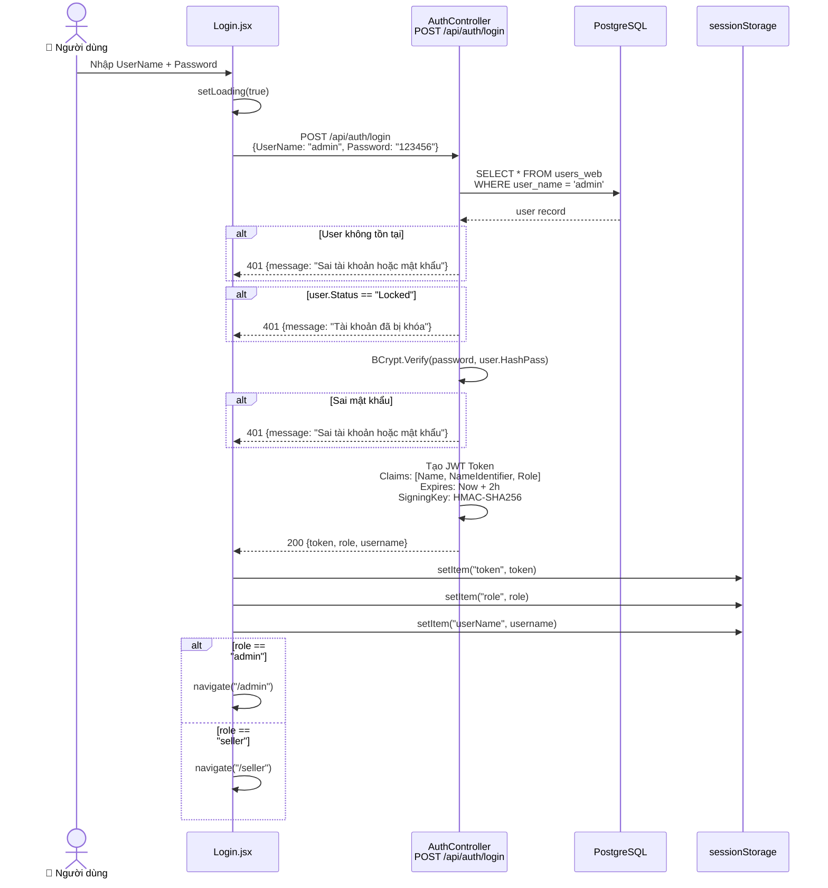
```mermaid
sequenceDiagram
    actor User as 👤 Người dùng
    participant FE as Login.jsx
    participant API as AuthController<br/>POST /api/auth/login
    participant DB as PostgreSQL
    participant SS as sessionStorage

    User->>FE: Nhập UserName + Password
    FE->>FE: setLoading(true)
    FE->>API: POST /api/auth/login<br/>{UserName: "admin", Password: "123456"}

    API->>DB: SELECT * FROM users_web<br/>WHERE user_name = 'admin'
    DB-->>API: user record

    alt User không tồn tại
        API-->>FE: 401 {message: "Sai tài khoản hoặc mật khẩu"}
    end

    alt user.Status == "Locked"
        API-->>FE: 401 {message: "Tài khoản đã bị khóa"}
    end

    API->>API: BCrypt.Verify(password, user.HashPass)
    alt Sai mật khẩu
        API-->>FE: 401 {message: "Sai tài khoản hoặc mật khẩu"}
    end

    API->>API: Tạo JWT Token<br/>Claims: [Name, NameIdentifier, Role]<br/>Expires: Now + 2h<br/>SigningKey: HMAC-SHA256

    API-->>FE: 200 {token, role, username}

    FE->>SS: setItem("token", token)
    FE->>SS: setItem("role", role)
    FE->>SS: setItem("userName", username)

    alt role == "admin"
        FE->>FE: navigate("/admin")
    else role == "seller"
        FE->>FE: navigate("/seller")
    end
```

---

### 6.3 Admin tạo POI mới (NarrationPointController.Create)

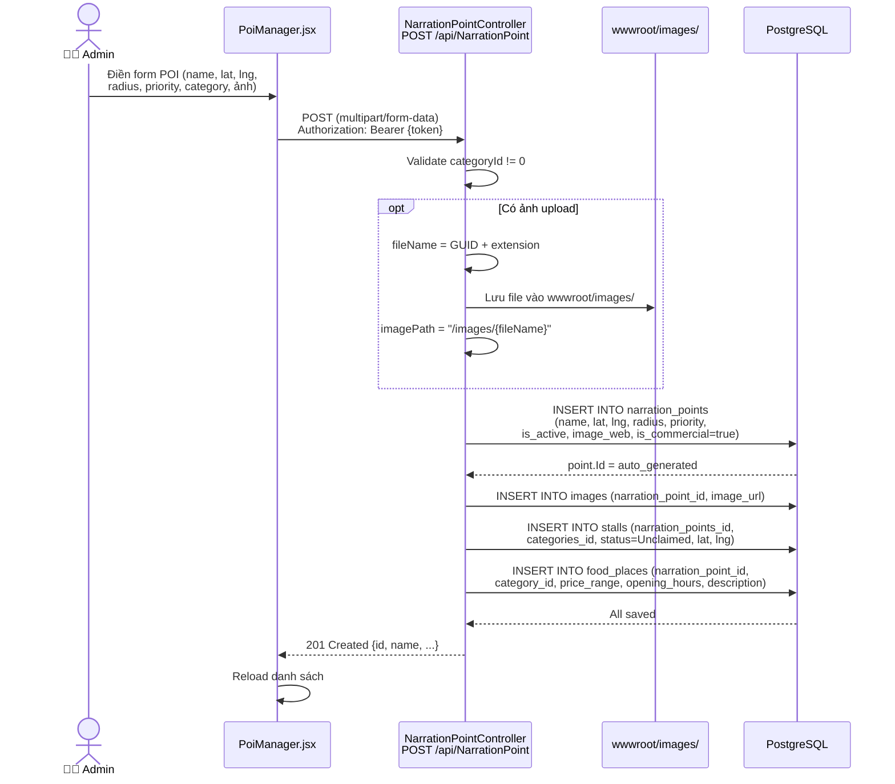
```mermaid
sequenceDiagram
    actor Admin as 🧑‍💼 Admin
    participant FE as PoiManager.jsx
    participant API as NarrationPointController<br/>POST /api/NarrationPoint
    participant FS as wwwroot/images/
    participant DB as PostgreSQL

    Admin->>FE: Điền form POI (name, lat, lng,<br/>radius, priority, category, ảnh)
    FE->>API: POST (multipart/form-data)<br/>Authorization: Bearer {token}

    API->>API: Validate categoryId != 0

    opt Có ảnh upload
        API->>API: fileName = GUID + extension
        API->>FS: Lưu file vào wwwroot/images/
        API->>API: imagePath = "/images/{fileName}"
    end

    API->>DB: INSERT INTO narration_points<br/>(name, lat, lng, radius, priority,<br/>is_active, image_web, is_commercial=true)
    DB-->>API: point.Id = auto_generated

    API->>DB: INSERT INTO images (narration_point_id, image_url)
    API->>DB: INSERT INTO stalls (narration_points_id,<br/>categories_id, status=Unclaimed, lat, lng)
    API->>DB: INSERT INTO food_places (narration_point_id,<br/>category_id, price_range, opening_hours, description)
    DB-->>API: All saved

    API-->>FE: 201 Created {id, name, ...}
    FE->>FE: Reload danh sách
```

---

### 6.4 Admin xóa POI — Cascade Delete (NarrationPointController.Delete)

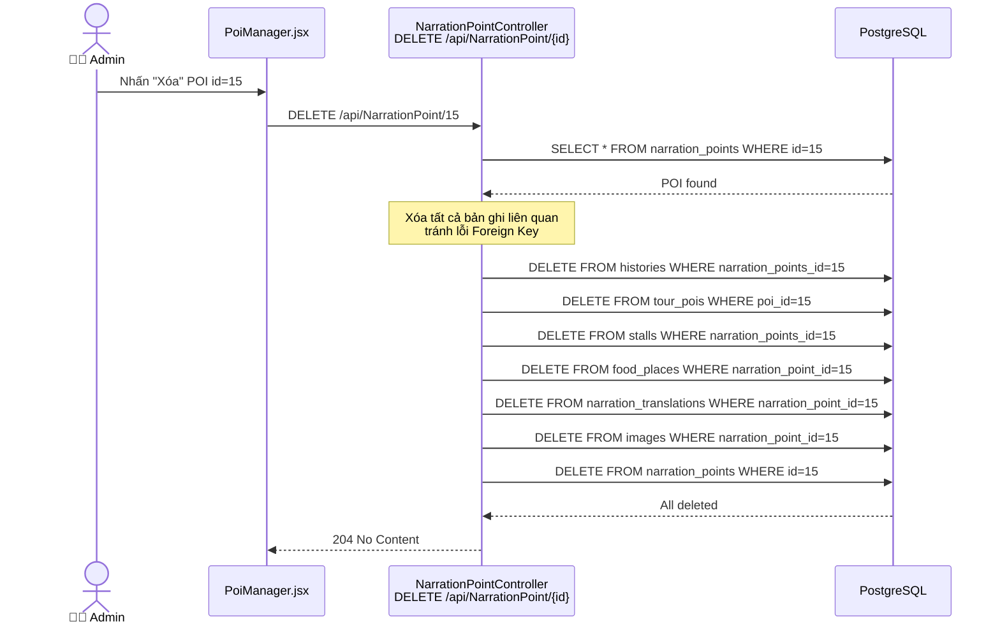
```mermaid
sequenceDiagram
    actor Admin as 🧑‍💼 Admin
    participant FE as PoiManager.jsx
    participant API as NarrationPointController<br/>DELETE /api/NarrationPoint/{id}
    participant DB as PostgreSQL

    Admin->>FE: Nhấn "Xóa" POI id=15
    FE->>API: DELETE /api/NarrationPoint/15

    API->>DB: SELECT * FROM narration_points WHERE id=15
    DB-->>API: POI found

    Note over API: Xóa tất cả bản ghi liên quan<br/>tránh lỗi Foreign Key

    API->>DB: DELETE FROM histories WHERE narration_points_id=15
    API->>DB: DELETE FROM tour_pois WHERE poi_id=15
    API->>DB: DELETE FROM stalls WHERE narration_points_id=15
    API->>DB: DELETE FROM food_places WHERE narration_point_id=15
    API->>DB: DELETE FROM narration_translations WHERE narration_point_id=15
    API->>DB: DELETE FROM images WHERE narration_point_id=15
    API->>DB: DELETE FROM narration_points WHERE id=15
    DB-->>API: All deleted

    API-->>FE: 204 No Content
```

---

### 6.5 Admin tạo Tour (TourController.CreateTour)

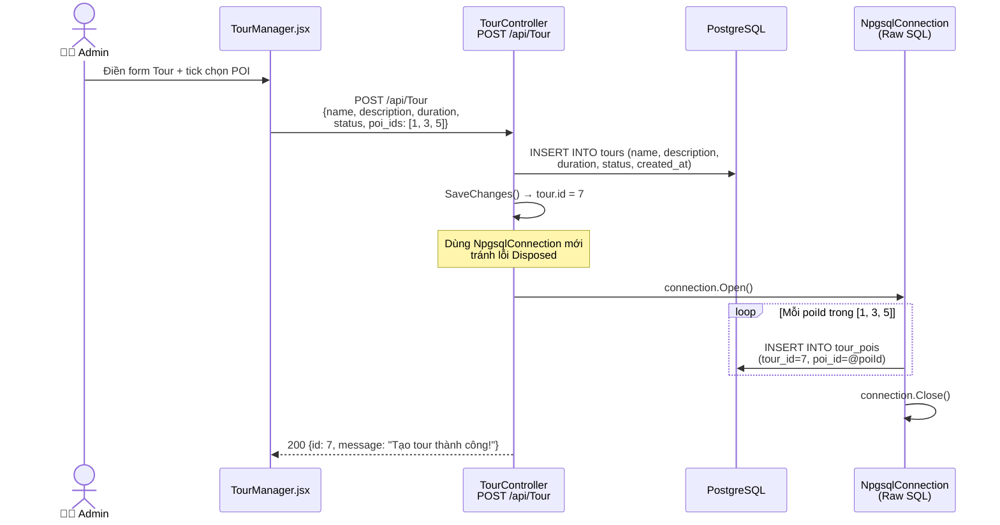
```mermaid
sequenceDiagram
    actor Admin as 🧑‍💼 Admin
    participant FE as TourManager.jsx
    participant API as TourController<br/>POST /api/Tour
    participant DB as PostgreSQL
    participant PG as NpgsqlConnection<br/>(Raw SQL)

    Admin->>FE: Điền form Tour + tick chọn POI
    FE->>API: POST /api/Tour<br/>{name, description, duration,<br/>status, poi_ids: [1, 3, 5]}

    API->>DB: INSERT INTO tours (name, description,<br/>duration, status, created_at)
    API->>API: SaveChanges() → tour.id = 7

    Note over API: Dùng NpgsqlConnection mới<br/>tránh lỗi Disposed

    API->>PG: connection.Open()
    loop Mỗi poiId trong [1, 3, 5]
        PG->>DB: INSERT INTO tour_pois<br/>(tour_id=7, poi_id=@poiId)
    end
    PG->>PG: connection.Close()

    API-->>FE: 200 {id: 7, message: "Tạo tour thành công!"}
```

---

### 6.6 Admin cập nhật Tour (TourController.Update)

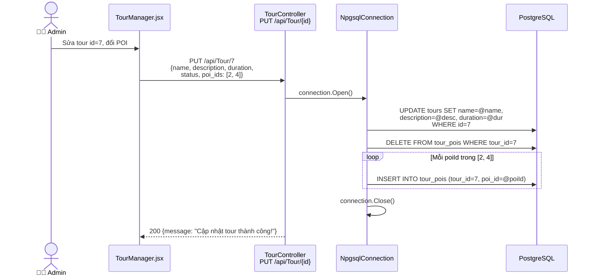
```mermaid
sequenceDiagram
    actor Admin as 🧑‍💼 Admin
    participant FE as TourManager.jsx
    participant API as TourController<br/>PUT /api/Tour/{id}
    participant PG as NpgsqlConnection
    participant DB as PostgreSQL

    Admin->>FE: Sửa tour id=7, đổi POI
    FE->>API: PUT /api/Tour/7<br/>{name, description, duration,<br/>status, poi_ids: [2, 4]}

    API->>PG: connection.Open()
    PG->>DB: UPDATE tours SET name=@name,<br/>description=@desc, duration=@dur<br/>WHERE id=7
    PG->>DB: DELETE FROM tour_pois WHERE tour_id=7
    loop Mỗi poiId trong [2, 4]
        PG->>DB: INSERT INTO tour_pois (tour_id=7, poi_id=@poiId)
    end
    PG->>PG: connection.Close()

    API-->>FE: 200 {message: "Cập nhật tour thành công!"}
```

---

### 6.7 Seller nhận quầy hàng Claim (UpdateRequestsController)

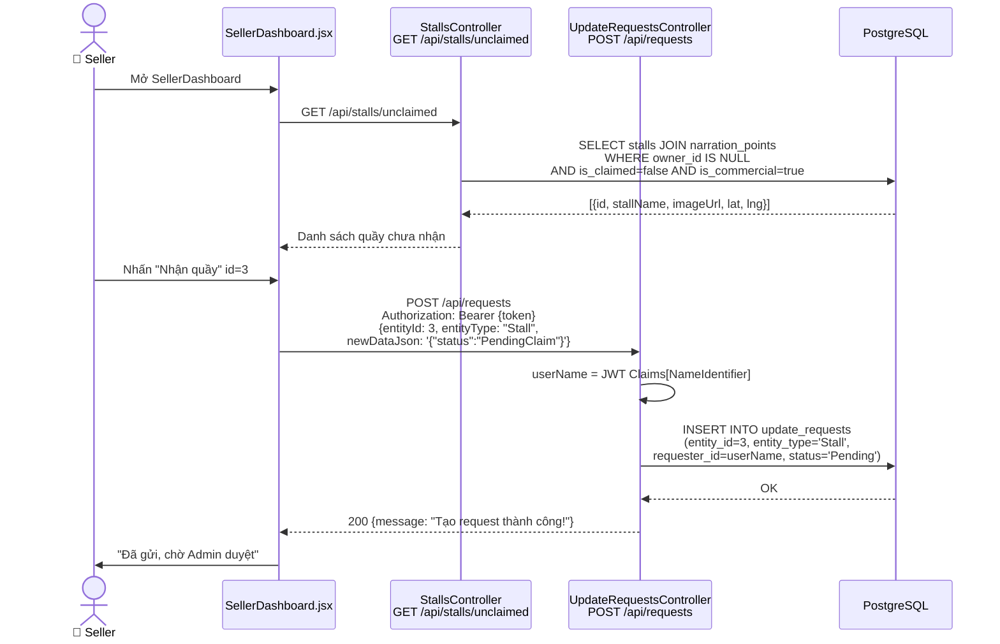
```mermaid
sequenceDiagram
    actor Seller as 🏪 Seller
    participant FE as SellerDashboard.jsx
    participant API_S as StallsController<br/>GET /api/stalls/unclaimed
    participant API_R as UpdateRequestsController<br/>POST /api/requests
    participant DB as PostgreSQL

    Seller->>FE: Mở SellerDashboard
    FE->>API_S: GET /api/stalls/unclaimed
    API_S->>DB: SELECT stalls JOIN narration_points<br/>WHERE owner_id IS NULL<br/>AND is_claimed=false AND is_commercial=true
    DB-->>API_S: [{id, stallName, imageUrl, lat, lng}]
    API_S-->>FE: Danh sách quầy chưa nhận

    Seller->>FE: Nhấn "Nhận quầy" id=3

    FE->>API_R: POST /api/requests<br/>Authorization: Bearer {token}<br/>{entityId: 3, entityType: "Stall",<br/>newDataJson: '{"status":"PendingClaim"}'}

    API_R->>API_R: userName = JWT Claims[NameIdentifier]
    API_R->>DB: INSERT INTO update_requests<br/>(entity_id=3, entity_type='Stall',<br/>requester_id=userName, status='Pending')
    DB-->>API_R: OK

    API_R-->>FE: 200 {message: "Tạo request thành công!"}
    FE->>Seller: "Đã gửi, chờ Admin duyệt"
```

---

### 6.8 Admin duyệt Claim Stall (Approve — Case PendingClaim)

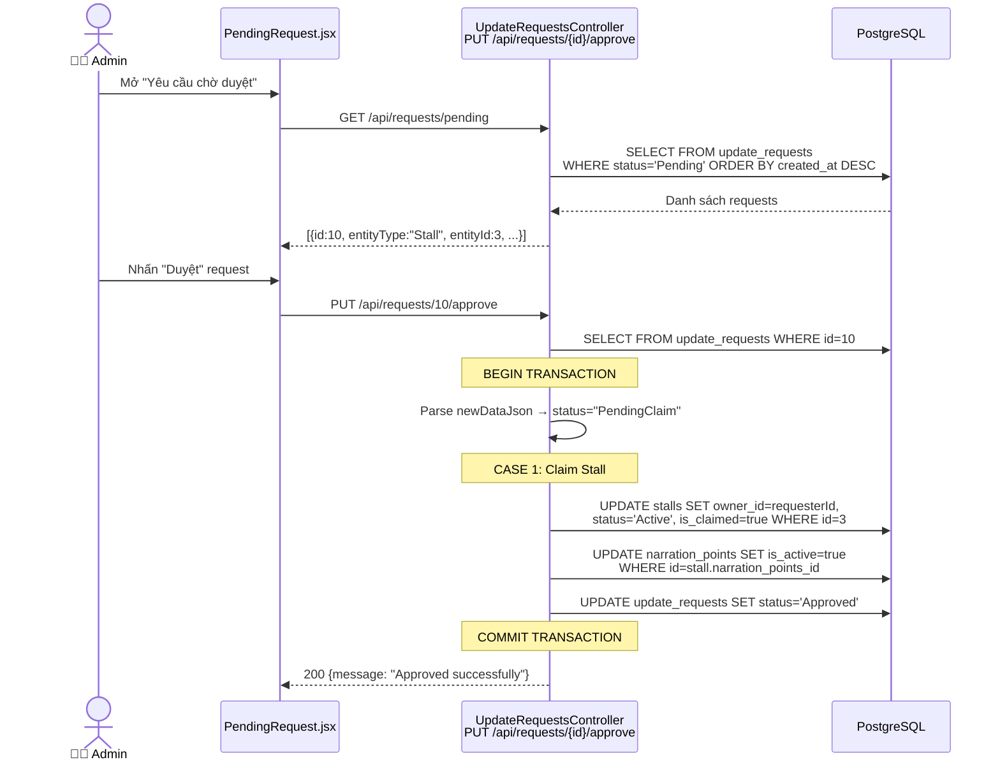
```mermaid
sequenceDiagram
    actor Admin as 🧑‍💼 Admin
    participant FE as PendingRequest.jsx
    participant API as UpdateRequestsController<br/>PUT /api/requests/{id}/approve
    participant DB as PostgreSQL

    Admin->>FE: Mở "Yêu cầu chờ duyệt"
    FE->>API: GET /api/requests/pending
    API->>DB: SELECT FROM update_requests<br/>WHERE status='Pending' ORDER BY created_at DESC
    DB-->>API: Danh sách requests
    API-->>FE: [{id:10, entityType:"Stall", entityId:3, ...}]

    Admin->>FE: Nhấn "Duyệt" request #10
    FE->>API: PUT /api/requests/10/approve

    API->>DB: SELECT FROM update_requests WHERE id=10
    Note over API: BEGIN TRANSACTION

    API->>API: Parse newDataJson → status="PendingClaim"
    Note over API: CASE 1: Claim Stall

    API->>DB: UPDATE stalls SET owner_id=requesterId,<br/>status='Active', is_claimed=true WHERE id=3
    API->>DB: UPDATE narration_points SET is_active=true<br/>WHERE id=stall.narration_points_id
    API->>DB: UPDATE update_requests SET status='Approved'

    Note over API: COMMIT TRANSACTION
    API-->>FE: 200 {message: "Approved successfully"}
```

---

### 6.9 Seller tạo quầy mới (entityId=0)

```mermaid
sequenceDiagram
    actor Seller as 🏪 Seller
    participant FE as SellerDashboard.jsx
    participant API as UpdateRequestsController<br/>POST /api/requests
    participant DB as PostgreSQL

    Seller->>FE: Nhấn "Tạo quầy mới"
    FE->>Seller: Form: stallName, category, lat, lng,<br/>ảnh, giá, giờ mở cửa, mô tả

    Seller->>FE: Điền + upload ảnh → Base64

    FE->>API: POST /api/requests<br/>{entityId: 0, entityType: "Stall",<br/>newDataJson: '{"stallName":"...",<br/>"categories_id":1, "latitude":10.7,<br/>"image_url":"data:image/png;base64,...",<br/>"status":"Active"}'}

    Note over FE,API: entityId=0 → Tạo mới

    API->>DB: INSERT INTO update_requests<br/>(entity_id=0, status='Pending', ...)
    API-->>FE: 200 OK
```

---

### 6.10 Admin duyệt tạo quầy mới (Approve — Case Create)

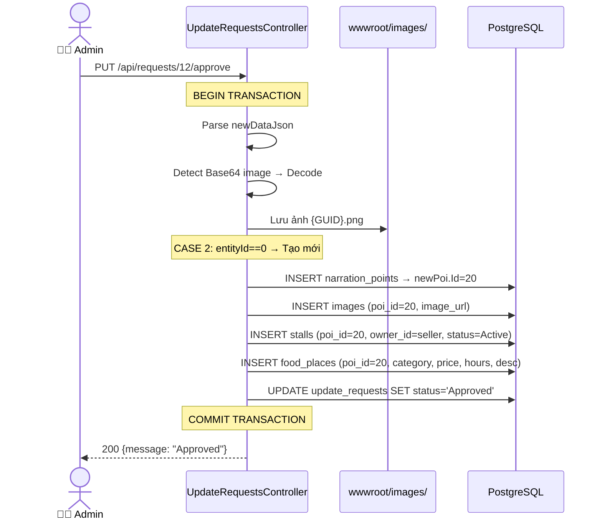
```mermaid
sequenceDiagram
    actor Admin as 🧑‍💼 Admin
    participant API as UpdateRequestsController
    participant FS as wwwroot/images/
    participant DB as PostgreSQL

    Admin->>API: PUT /api/requests/12/approve

    Note over API: BEGIN TRANSACTION
    API->>API: Parse newDataJson
    API->>API: Detect Base64 image → Decode
    API->>FS: Lưu ảnh {GUID}.png
    Note over API: CASE 2: entityId==0 → Tạo mới

    API->>DB: INSERT narration_points → newPoi.Id=20
    API->>DB: INSERT images (poi_id=20, image_url)
    API->>DB: INSERT stalls (poi_id=20, owner_id=seller, status=Active)
    API->>DB: INSERT food_places (poi_id=20, category, price, hours, desc)
    API->>DB: UPDATE update_requests SET status='Approved'

    Note over API: COMMIT TRANSACTION
    API-->>Admin: 200 {message: "Approved"}
```

---

### 6.11 Admin từ chối yêu cầu (Reject)

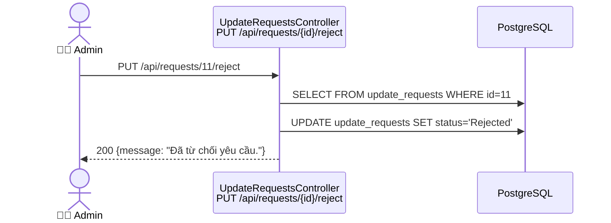
```mermaid
sequenceDiagram
    actor Admin as 🧑‍💼 Admin
    participant API as UpdateRequestsController<br/>PUT /api/requests/{id}/reject
    participant DB as PostgreSQL

    Admin->>API: PUT /api/requests/11/reject
    API->>DB: SELECT FROM update_requests WHERE id=11
    API->>DB: UPDATE update_requests SET status='Rejected'
    API-->>Admin: 200 {message: "Đã từ chối yêu cầu."}
```

---

### 6.12 Seller cập nhật bản dịch (Translation Request)

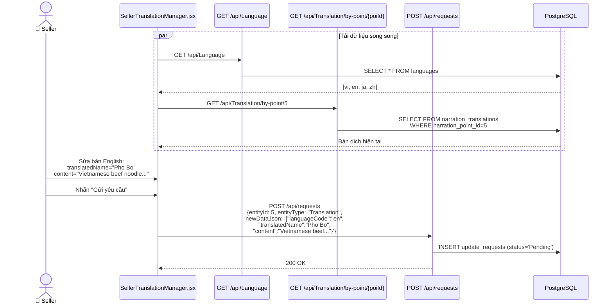
```mermaid
sequenceDiagram
    actor Seller as 🏪 Seller
    participant FE as SellerTranslationManager.jsx
    participant API_L as GET /api/Language
    participant API_T as GET /api/Translation/by-point/{poiId}
    participant API_R as POST /api/requests
    participant DB as PostgreSQL

    par Tải dữ liệu song song
        FE->>API_L: GET /api/Language
        API_L->>DB: SELECT * FROM languages
        DB-->>FE: [vi, en, ja, zh]

        FE->>API_T: GET /api/Translation/by-point/5
        API_T->>DB: SELECT FROM narration_translations<br/>WHERE narration_point_id=5
        DB-->>FE: Bản dịch hiện tại
    end

    Seller->>FE: Sửa bản English:<br/>translatedName="Pho Bo"<br/>content="Vietnamese beef noodle..."
    Seller->>FE: Nhấn "Gửi yêu cầu"

    FE->>API_R: POST /api/requests<br/>{entityId: 5, entityType: "Translation",<br/>newDataJson: '{"languageCode":"en",<br/>"translatedName":"Pho Bo",<br/>"content":"Vietnamese beef..."}'}

    API_R->>DB: INSERT update_requests (status='Pending')
    API_R-->>FE: 200 OK
```

---

### 6.13 Admin duyệt bản dịch (Approve Translation)

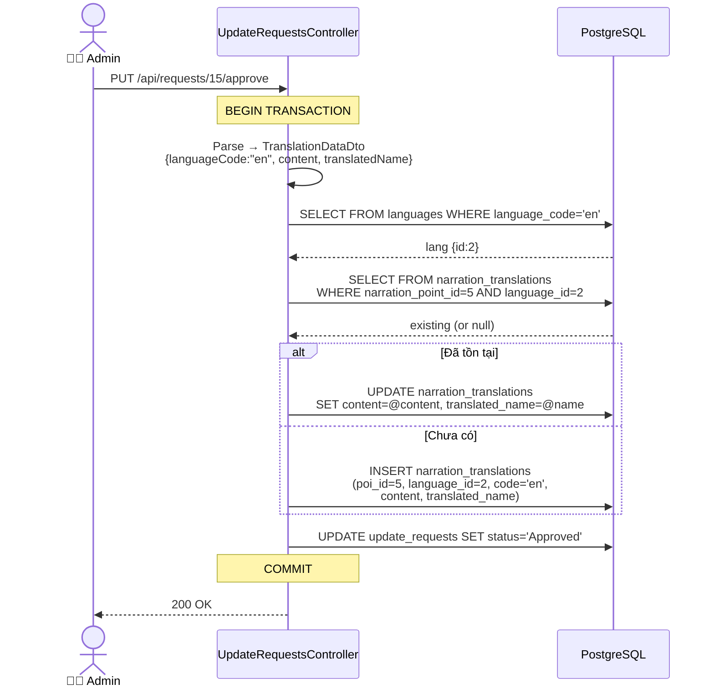
```mermaid
sequenceDiagram
    actor Admin as 🧑‍💼 Admin
    participant API as UpdateRequestsController
    participant DB as PostgreSQL

    Admin->>API: PUT /api/requests/15/approve

    Note over API: BEGIN TRANSACTION
    API->>API: Parse → TranslationDataDto<br/>{languageCode:"en", content, translatedName}

    API->>DB: SELECT FROM languages WHERE language_code='en'
    DB-->>API: lang {id:2}

    API->>DB: SELECT FROM narration_translations<br/>WHERE narration_point_id=5 AND language_id=2
    DB-->>API: existing (or null)

    alt Đã tồn tại
        API->>DB: UPDATE narration_translations<br/>SET content=@content, translated_name=@name
    else Chưa có
        API->>DB: INSERT narration_translations<br/>(poi_id=5, language_id=2, code='en',<br/>content, translated_name)
    end

    API->>DB: UPDATE update_requests SET status='Approved'
    Note over API: COMMIT
    API-->>Admin: 200 OK
```

---

### 6.14 Du khách sử dụng app thuyết minh (Mobile — Offline)

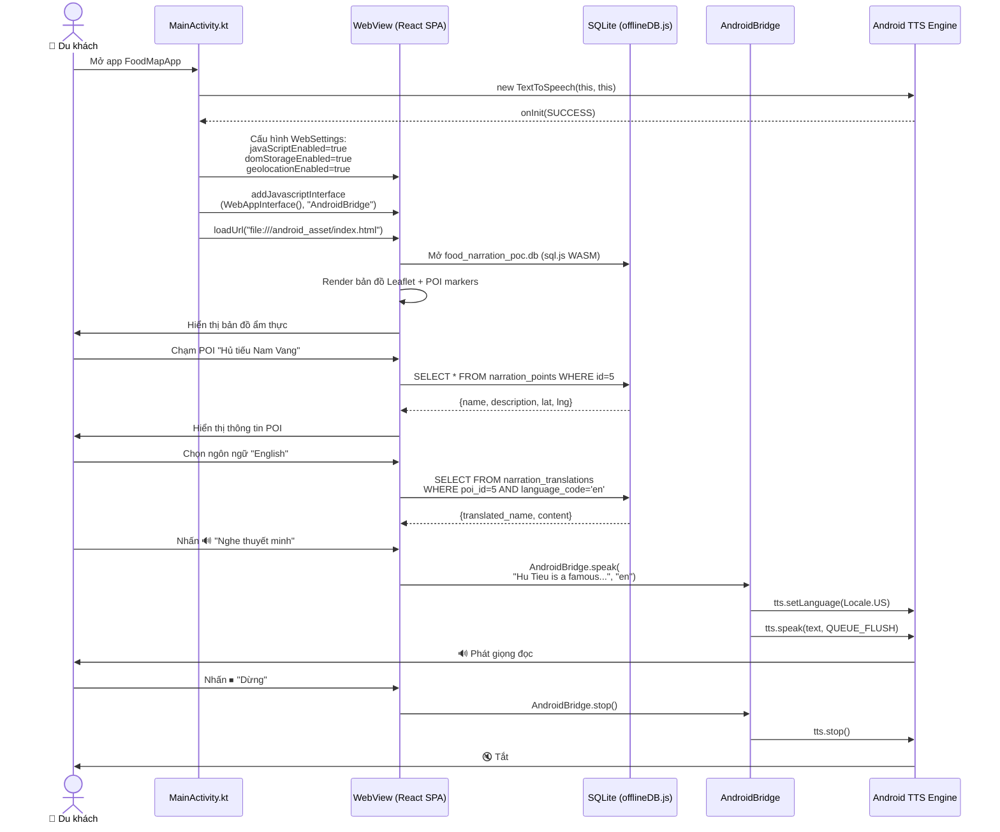
```mermaid
sequenceDiagram
    actor Tourist as 📱 Du khách
    participant APP as MainActivity.kt
    participant WV as WebView (React SPA)
    participant SQL as SQLite (offlineDB.js)
    participant BRIDGE as AndroidBridge
    participant TTS as Android TTS Engine

    Tourist->>APP: Mở app FoodMapApp

    APP->>TTS: new TextToSpeech(this, this)
    TTS-->>APP: onInit(SUCCESS)

    APP->>WV: Cấu hình WebSettings:<br/>javaScriptEnabled=true<br/>domStorageEnabled=true<br/>geolocationEnabled=true

    APP->>WV: addJavascriptInterface<br/>(WebAppInterface(), "AndroidBridge")

    APP->>WV: loadUrl("file:///android_asset/index.html")
    WV->>SQL: Mở food_narration_poc.db (sql.js WASM)
    WV->>WV: Render bản đồ Leaflet + POI markers
    WV->>Tourist: Hiển thị bản đồ ẩm thực

    Tourist->>WV: Chạm POI "Hủ tiếu Nam Vang"
    WV->>SQL: SELECT * FROM narration_points WHERE id=5
    SQL-->>WV: {name, description, lat, lng}
    WV->>Tourist: Hiển thị thông tin POI

    Tourist->>WV: Chọn ngôn ngữ "English"
    WV->>SQL: SELECT FROM narration_translations<br/>WHERE poi_id=5 AND language_code='en'
    SQL-->>WV: {translated_name, content}

    Tourist->>WV: Nhấn 🔊 "Nghe thuyết minh"
    WV->>BRIDGE: AndroidBridge.speak(<br/>"Hu Tieu is a famous...", "en")
    BRIDGE->>TTS: tts.setLanguage(Locale.US)
    BRIDGE->>TTS: tts.speak(text, QUEUE_FLUSH)
    TTS->>Tourist: 🔊 Phát giọng đọc

    Tourist->>WV: Nhấn ⏹ "Dừng"
    WV->>BRIDGE: AndroidBridge.stop()
    BRIDGE->>TTS: tts.stop()
    TTS->>Tourist: 🔇 Tắt
```

---

## 7. Sơ đồ triển khai

```mermaid
graph TB
    subgraph "Client"
        ANDROID["📱 Android Device<br/>minSdk: 24, targetSdk: 33"]
        BROWSER["💻 Browser (Chrome/Firefox)"]
    end

    subgraph "Server (Localhost)"
        VITE["Vite Dev Server :5173"]
        DOTNET_WEB[".NET Kestrel :5050<br/>(Web Backend)"]
        DOTNET_APP[".NET Kestrel :5111<br/>(Mobile Backend)"]
    end

    subgraph "Cloud (Supabase)"
        PGBOUNCER["PgBouncer :6543"]
        POSTGRES["PostgreSQL 15"]
    end

    ANDROID -->|HTTP| DOTNET_APP
    BROWSER -->|HTTP| VITE
    VITE -->|Proxy| DOTNET_WEB
    DOTNET_WEB -->|Npgsql+SSL| PGBOUNCER
    DOTNET_APP -->|Supabase SDK| PGBOUNCER
    PGBOUNCER --> POSTGRES
```

---

## 8. Sơ đồ thành phần

### 8.1 Web Application

```mermaid
graph TB
    subgraph "Frontend React"
        APP["App.jsx (Router)"]
        LOGIN["Login.jsx"]
        REG["Register.jsx"]

        subgraph "Admin (8 trang)"
            AD["AdminDashboard"]
            PM["PoiManager"]
            TM["TourManager"]
            AM["AudioManager"]
            TR["TranslationManager"]
            UM["UserManager"]
            HM["HistoryManager"]
            PR["PendingRequest"]
        end

        subgraph "Seller (3 trang)"
            SD["SellerDashboard"]
            SA["SellerAudioManager"]
            ST["SellerTranslationManager"]
        end
    end

    subgraph "Backend ASP.NET (15 Controllers)"
        AUTH["AuthController"]
        POIC["PoiController"]
        TOURC["TourController"]
        STALLC["StallController"]
        AUDIOC["AudioController"]
        TRANSC["TranslationController"]
        USERC["UserManagerController"]
        HISTC["HistoryController"]
        REQC["UpdateRequestsController"]
    end

    LOGIN --> AUTH
    AD --> AUTH
    PM --> POIC
    TM --> TOURC
    AM --> AUDIOC
    TR --> TRANSC
    UM --> USERC
    HM --> HISTC
    PR --> REQC
    SD --> STALLC
    SD --> REQC
```

### 8.2 Mobile Application

```mermaid
graph TB
    subgraph "Android (Kotlin)"
        MA["MainActivity.kt"]
        WV["WebView"]
        TTS["TextToSpeech"]
        JB["JavascriptInterface<br/>(AndroidBridge)"]
    end

    subgraph "Embedded Web (assets/)"
        IDX["index.html"]
        REACT["App.js (React SPA)"]
        OFFLINE["offlineDB.js (sql.js)"]
        SQLITE["food_narration_poc.db"]
    end

    MA --> WV --> IDX --> REACT
    REACT --> OFFLINE --> SQLITE
    WV --> JB --> TTS
```

---

## 9. Công nghệ sử dụng

### Backend

| Công nghệ | Phiên bản | Mục đích |
|---|---|---|
| ASP.NET Core | .NET 10 | Web API Framework |
| Entity Framework Core | 9.0.4 | ORM |
| Npgsql | 9.0.4 | PostgreSQL Driver |
| BCrypt.Net | 4.1.0 | Hash mật khẩu |
| JWT Bearer | 9.0.4 | Xác thực token |
| Supabase C# SDK | 0.16.2 | Supabase Client (Mobile) |

### Frontend

| Công nghệ | Phiên bản | Mục đích |
|---|---|---|
| React | 18.3.1 | UI Framework |
| Vite | 5.0.0 | Build Tool |
| React Router DOM | 7.13.1 | Routing |
| Leaflet + React Leaflet | 1.9.4 / 5.0.0 | Bản đồ |
| Lucide React | 1.7.0 | Icons |

### Mobile

| Công nghệ | Mục đích |
|---|---|
| Kotlin + Jetpack Compose | Android App |
| WebView + JavascriptInterface | Nhúng web + cầu nối Native |
| TextToSpeech API | Đọc văn bản thành giọng nói |
| sql.js (WebAssembly) | SQLite offline trên browser |

### Database

| Công nghệ | Mục đích |
|---|---|
| PostgreSQL 15 (Supabase) | CSDL chính (cloud) |
| SQLite | Offline trên mobile |
| PgBouncer | Connection Pooling |

---

## 10. Chi tiết các module

| Module | Controller | Chức năng chính |
|---|---|---|
| **Xác thực** | AuthController | Register (BCrypt hash), Login (JWT 2h) |
| **POI** | NarrationPointController | CRUD + upload ảnh + tạo stall/food_place/images |
| **Tour** | TourController | CRUD + link POI (raw Npgsql), suggested tours |
| **Stall** | StallsController | GetAll, Unclaimed, Claim, Create, Update |
| **Audio** | AudioController | CRUD audio files |
| **Translation** | TranslationController | CRUD translations (4 ngôn ngữ) |
| **Category** | CategoryController | GET categories |
| **Language** | LanguageController | GET languages |
| **User** | UserManagerController | CRUD users, khóa/mở khóa |
| **History** | HistoryController | Logs, stats, heatmap |
| **Requests** | UpdateRequestsController | Create/Approve/Reject (Transaction) |
| **TTS Mobile** | MainActivity.kt | speak(text, lang), stop() |

---

## 11. Kết luận

### Kết quả đạt được
- Xây dựng hoàn chỉnh hệ thống thuyết minh ẩm thực đa nền tảng (Web + Mobile)
- Hỗ trợ đa ngôn ngữ với Text-to-Speech native Android
- Hoạt động offline trên thiết bị di động (SQLite + sql.js)
- Quản trị nội dung linh hoạt với phân quyền Admin/Seller
- Quy trình duyệt Request (Pending → Approved/Rejected) với Transaction

### Hướng phát triển
- Tích hợp AI để dịch tự động
- Thêm tính năng AR (Augmented Reality)
- Phát triển phiên bản iOS (Swift/SwiftUI)
- Push notification khi đến gần POI
- Hệ thống đánh giá và review từ du khách

---

> **Sinh viên thực hiện**: Nguyễn Thành
> **Năm học**: 2025-2026
