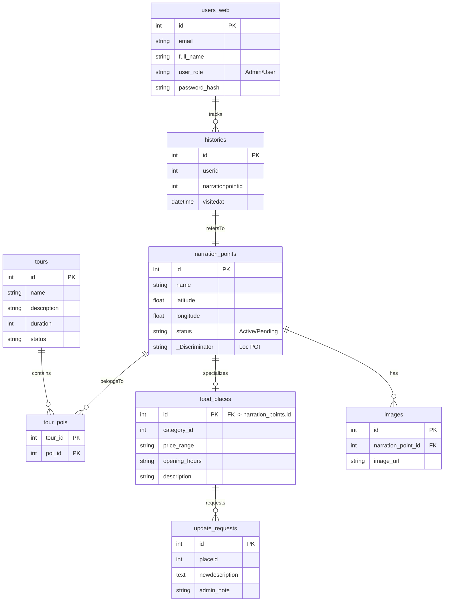

# BÁO CÁO ĐỒ ÁN: HỆ THỐNG FOODMAP - VĨNH KHÁNH TẬP TRUNG

## I. TỔNG QUAN DỰ ÁN
**Mục tiêu dự án:** Thiết kế một hệ thống hỗ trợ du khách khám phá khu phố ẩm thực bằng cách cung cấp ứng dụng di động tương tác Bản đồ trực tuyến. Thay vì đọc tài liệu rườm rà, du khách chỉ cần dạo bước trên phố, hệ thống GPS của ứng dụng sẽ tự động phân tích và kích hoạt công nghệ Hộp Âm Thanh (Text-To-Speech) mô tả các món ăn khi du khách đi ngang qua cửa tiệm. Hệ thống hoạt động theo đa ngôn ngữ (Việt, Anh, Trung).

**Mô hình hoạt động (Phân mảnh):**
- **Web Admin Dashboard (React):** Công cụ quản lý dành cho nhà điều hành nhằm vẽ lịch trình tour ảo, kiểm duyệt và chốt danh sách điểm ẩm thực (POI).
- **Mobile Android App (React PWA WebView):** Ứng dụng tích hợp trực tiếp Bản đồ, theo dõi GPS người dùng và phát âm thanh từ xa tại thiết bị của họ.
- **Hệ thống Serverless DB:** Supabase (PostgreSQL) đảm nhận vai trò lưu trữ thời gian thực (Realtime Storage). Cả hai Backends (.NET) đóng vai trò trung gian trao đổi RESTful.

---

## II. SƠ ĐỒ USE CASE (LƯU ĐỒ SỬ DỤNG)
Hệ thống xoay quanh 2 thực thể chính: **Quản trị viên (Admin)** và **Người dùng (Điện thoại/Du khách)**.

```mermaid
usecaseDiagram
    actor DuKhach as "Du Khách (Mobile)"
    actor Admin as "Quản Trị Viên (Web)"

    package "Mobile App System" {
        usecase UC1 as "Xem danh sách Tour Gợi Ý"
        usecase UC2 as "Tracking GPS thời gian thực"
        usecase UC3 as "Nghe thuyết minh TTS tự động"
        usecase UC4 as "Chạy Tour Ảo (Auto Navigation)"
        usecase UC5 as "Lưu danh sách Quán Yêu Thích"
        usecase UC6 as "Dịch thuật đa ngôn ngữ"
    }

    package "Web Admin System" {
        usecase UC7 as "Quản lý Cửa tiệm/POI"
        usecase UC8 as "Tạo mới & Thiết kế Lộ trình Tour"
        usecase UC9 as "Quản lý Người dùng Cấp cao"
        usecase UC10 as "Duyệt yêu cầu thay đổi (Request)"
    }

    DuKhach --> UC1
    DuKhach --> UC2
    DuKhach --> UC5
    UC2 .> UC3 : include (Kích hoạt khi <30m)
    UC1 .> UC4 : extends (Chọn Tour cụ thể)
    UC3 .> UC6 : include

    Admin --> UC7
    Admin --> UC8
    Admin --> UC9
    Admin --> UC10
```

---

## III. SƠ ĐỒ THỰC THỂ KẾT HỢP (ERD)
Sơ đồ triển khai Cấu trúc CSDL tại lõi phân tán Supabase (Postgres). 



---

## IV. KIẾN TRÚC HỆ THỐNG (DEPLOYMENT & COMPONENT DIAGRAM)

```mermaid
graph TD
    subgraph "Môi Trường Khách Hàng (Client)"
        C1[Android App - WebView PWA]
        C2[Trình duyệt Desktop Web Admin]
    end

    subgraph "Tầng API - Backends (.NET 10)"
        B1("App API Services (Port: 6111) \n - Trả vị trí POI \n - Chặn lọc dữ liệu cho thiết bị yếu")
        B2("Web API (Port: 6050) \n - Controller CRUD \n - Thống kê \n - Kiểm duyệt request")
    end

    subgraph "Nền tảng Đám Mây (Cloud Services)"
        S1[(Supabase PostgreSQL Database)]
        S2[Supabase Storage - Image CDN]
        S3[Google Translate TTS Engine \n - Web Speech API]
        S4[Bản đồ TileLayer CartoDB / OSM]
    end

    C1 <-->|REST(JSON)| B1
    C2 <-->|REST(JSON)| B2

    C1 --->|Nạp Map Tiles| S4
    C1 -.->|Pha trộn Ngôn ngữ TTS| S3
    
    B1 ===>|Entity Framework| S1
    B2 ===>|Entity Framework| S1
    
    C1 -->|Lưu offline| LocalDB[(SQLite Local / Storage)]
    C1 -->|Hiển thị ảnh| S2
```

---

## V. SƠ ĐỒ TUẦN TỰ (SEQUENCE DIAGRAM): THEO DÕI VÀ PHÁT ÂM THANH GPS

Mô tả thuật toán tự động nhận diện thiết bị đi ngang qua nhà hàng ẩm thực và kích hoạt thuyết minh AI độc quyền.

```mermaid
sequenceDiagram
    autonumber
    participant D as Điện thoại (Android Location)
    participant M as Component App.js (Bản đồ)
    participant B as Backend APi (places)
    participant TTS as Trình Đọc Chữ HĐH (TTS)

    M->>B: Gửi hàm Fetch yêu cầu Load POIs với tham số Lang="vi"
    B-->>M: Trả JSON 200 (Danh sách Quán Tọa độ, Radius)
    M->>D: Khởi chạy navigator.geolocation.watchPosition()

    loop Mỗi khi người dùng di chuyển (GPS Update)
        D->>M: Bắn Event Tọa độ mới (Lat, Lng)
        M->>M: Dùng Hàm Haversine Formula <br/> tính [Khoảng cách] với toàn bộ Quán ăn
        
        alt Khoảng cách < Bán kính điểm chạm (Activation Radius = 30m)
            M->>M: SetActive(); Tạo Marker Đỏ Nhấp nháy
            M->>TTS: speechSynthesis.speak("Tiếng quán ăn này...")
            TTS-->>M: Hoàn tất đọc giọng hệ thống / Google API
            M->>M: Hiển thị Modal hỏi chọn: <br/> Đi GPS tiếp hay Khởi động Virtual Tour Ảo?
        else Khoảng cách > Radius
            M->>M: Không làm gì, tiếp tục đợi.
        end
    end
```

---

## VI. TÍNH NĂNG VÀ CÔNG NGHỆ ÁP DỤNG TRỌNG TÂM

1. **Giao Diện "Food Delivery App" Bắt Mắt (UI/UX Transformation)**
   * Chuyển hóa toàn bộ ứng dụng Mobile thành thiết kế phẳng vuông vát cạnh `12px` với tone Đỏ Cam kích thích ăn uống.
   * Animation Radar Tactical Map (Định vị vệ tinh vòng sóng) vẽ tay bằng CSS Keyframes kết hợp thẻ `DivIcon` của Leaflet phá vỡ giới hạn marker tĩnh lỗi thời của thiết bị.

2. **Dữ liệu mượt mà & Chống Nghẽn Socket**
   * App Mobile không bao giờ bị đứng máy vì CSDL kết nối bằng Supabase Pooler (`port 6543`) để phân luồng hàng vạn Transaction Entity Framework.

3. **Cơ chế chạy Offline Caching Mềm (SQLite/WASM)**
   * Trong tình trạng sập Supabase do đứt cáp quang biển, App sẽ kích hoạt khối IF chạy `sql-wasm.wasm`, load ngầm Database cũ nhất có sẵn và hiển thị bản đồ nguyên trạng thay vì văng ứng dụng.

4. **Multi-Language Triggers**
   * Khắp App.js đã trang bị màng lọc Lang State (vi, en, zh). Khi thay đổi State, cả Giao diện (Dict Translations) lẫn Lời Kể Hệ Thống (`Prefix: Hệ thống GPS xác nhận bạn...`) được chèn đổi mượt mà. Đảm bảo hỗ trợ du lịch quốc tế tối đa.


